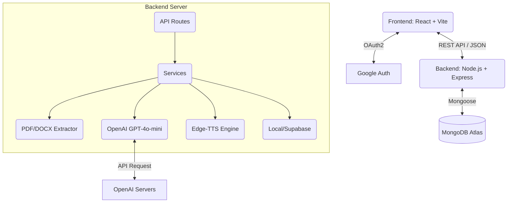

# PeerNoted - Nền tảng Quản lý Học tập Thông minh với AI 🚀

PeerNoted là một dự án EdTech (Công nghệ Giáo dục) đột phá, ứng dụng Trí tuệ Nhân tạo (Generative AI) để tự động hóa hoàn toàn quy trình tổ chức, tổng hợp và cá nhân hóa tài liệu học tập. Thay vì phải đọc thủ công hàng chục file PDF nhàm chán, PeerNoted giúp người dùng biến tài liệu thành các bản tóm tắt thông minh (Cheat Sheet) hoặc các tập Podcast sinh động.

---

## 🌟 1. Tổng quan Tính năng Cốt lõi

1. **Smart File Organizer (Trợ lý Phân loại):** 
   - Hỗ trợ tải lên đa định dạng: `PDF`, `DOCX`, Hình ảnh (`JPG/PNG`), `TXT`.
   - AI tự động trích xuất nội dung, phân tích ngữ cảnh và tự động tạo/phân loại vào các thư mục Môn học, Khối lớp, Chương bài.
   - Tự động gắn nhãn (Tags) thông minh để dễ dàng tìm kiếm.

2. **AI Cheat Sheet (Phao Cứu Cấp):**
   - Đọc hàng ngàn trang tài liệu và trích xuất ra các định nghĩa cốt lõi, công thức Toán/Lý/Hóa (Render chuẩn LaTeX), và các mẹo ghi nhớ.
   - Tích hợp cơ chế *Fallback thông minh*: Nếu file PDF là ảnh không thể trích xuất chữ, AI sẽ tự dùng kiến thức khổng lồ của nó dựa trên "Tên môn học" để tạo tài liệu thay thế.

3. **Edu-Podcast Generator (Kịch bản & Thu âm Podcast):**
   - Phân tích tài liệu học thuật khô khan và biên kịch lại thành một đoạn hội thoại Podcast giữa 2 MC (Nam & Nữ).
   - Tích hợp Edge TTS để biến kịch bản thành file âm thanh (MP3) tự nhiên, hỗ trợ nghe lại khi di chuyển.

4. **Resource Recommender (Gợi ý Tài nguyên):**
   - Quét chủ đề đang học để gợi ý các video YouTube, khóa học trực tuyến chính xác nhất.

---

## 🏗 2. Kiến trúc Hệ thống (System Architecture)

Dự án được xây dựng theo mô hình **Client - Server (SPA + REST API)**.



### 2.1 Luồng Xử lý Dữ liệu (Data Flow) chi tiết:
- **Luồng Upload & Phân loại:**
  1. Người dùng kéo thả file ở Client -> Gửi `multipart/form-data` qua Axios.
  2. Server dùng `multer` lưu file vào RAM buffer.
  3. Gọi `pdf-parse` hoặc `mammoth` bóc tách Text.
  4. Gửi Text (hoặc Image Buffer) tới API của OpenAI.
  5. OpenAI trả về JSON chứa `Môn học`, `Chương`, `Tags`.
  6. Server lưu File vật lý (Storage) và lưu Metadata vào MongoDB, trả kết quả về Client.

- **Luồng Tạo Podcast:**
  1. Client gửi ID Thư mục lên Server.
  2. Server query MongoDB lấy toàn bộ Text của các File trong Thư mục.
  3. Gửi Text cho OpenAI với prompt *Biên kịch Podcast*, nhận về Script chia dòng dạng `MC_A|||Nội dung`.
  4. Truyền Script vào `edge-tts-universal`, render ra file MP3 lưu xuống ổ cứng.
  5. Trả đường dẫn MP3 về Client để phát qua thẻ `<audio>`.

---

## 💻 3. Chi tiết Công nghệ Sử dụng (Tech Stack)

### Frontend
- **React 19 & Vite:** Nền tảng cốt lõi, Vite giúp HMR (Hot Module Replacement) siêu tốc.
- **Tailwind CSS:** Utility-first CSS framework để xây dựng UI hiện đại, Dark/Light mode dễ dàng.
- **React Router DOM:** Quản lý chuyển trang (Client-side routing).
- **React Markdown & rehype-katex:** Render văn bản Markdown và công thức toán học chuẩn LaTeX sinh ra từ AI.
- **@react-oauth/google:** Xử lý luồng đăng nhập One-tap an toàn của Google.

### Backend
- **Node.js & Express 5.x:** Xử lý HTTP request không đồng bộ cực nhanh.
- **Mongoose (MongoDB):** Quản lý Schema chặt chẽ cho `Users`, `Folders`, và `Files`.
- **OpenAI SDK (`openai`):** Trái tim của hệ thống AI, dùng model `gpt-4o-mini` cho tốc độ cao và chi phí thấp, hỗ trợ cả đọc hiểu văn bản lẫn thị giác máy tính (Vision).
- **Trích xuất Text:** `pdf-parse` (Cho file PDF), `mammoth` (Cho file Word DOCX).
- **Edge TTS Universal:** Giải pháp Text-to-Speech tự nhiên, miễn phí thay thế cho các API tốn kém.
- **JsonWebToken (JWT) & bcryptjs:** Bảo mật API và mã hóa session người dùng.

---

## 🚀 4. Hướng dẫn Triển khai (Deployment Guide) Từng Bước

Để hệ thống hoạt động hoàn hảo, bạn cần thiết lập 3 thành phần: Database, Backend và Frontend.

### Bước 1: Chuẩn bị tài khoản bên thứ 3
1. **MongoDB Atlas:** Tạo tài khoản tại [mongodb.com](https://www.mongodb.com/), tạo 1 Cluster miễn phí, tạo User DB và lấy chuỗi **Connection String** (URI).
2. **OpenAI API Key:** Đăng nhập [platform.openai.com](https://platform.openai.com/), nạp tối thiểu 5$ để mở khóa API (Vì tài khoản free-tier sẽ bị rate-limit rất nặng), tạo một API Key.
3. **Google Cloud Console:** Tạo dự án mới, vào mục *Credentials* tạo OAuth 2.0 Client IDs (Loại Web application), lấy **Client ID**. Set *Authorized JavaScript origins* là domain của bạn.

### Bước 2: Thiết lập chạy thử tại máy (Local Development)

**1. Clone dự án và tạo biến môi trường:**
Tại thư mục gốc của dự án `peernoted/`, tạo file `.env` với nội dung sau:
```env
PORT=5000
MONGODB_URI=mongodb+srv://<user>:<password>@cluster0.../peernoted
OPENAI_API_KEY=sk-proj-xxx_đây_là_key_của_bạn_xxx
JWT_SECRET=chuoi_mat_ma_bi_mat_cua_ban_12345
GOOGLE_CLIENT_ID=xxx.apps.googleusercontent.com
```

**2. Chạy Backend Server:**
```bash
cd server
npm install
npm run dev
```
*(Backend sẽ hiển thị `✅ MongoDB Connected` và chạy ở cổng `5000`)*

**3. Chạy Frontend Client:**
Mở một Terminal khác:
```bash
cd client
npm install
npm run dev
```
*(Giao diện web sẽ mở ở `http://localhost:5173`)*

---

### Bước 3: Triển khai lên Production (Internet)

#### A. Triển khai Backend lên Render (Miễn phí)
1. Đăng ký tài khoản [Render.com](https://render.com/).
2. Chọn **New Web Service**, kết nối với kho lưu trữ GitHub chứa code của bạn.
3. Cấu hình Render:
   - Root Directory: `server`
   - Build Command: `npm install`
   - Start Command: `npm start`
4. Ở mục **Environment Variables**, copy toàn bộ nội dung file `.env` của bạn vào (PORT để tự động).
5. Deploy và lấy tên miền do Render cấp (VD: `https://peernoted-api.onrender.com`).

#### B. Triển khai Frontend lên Vercel (Tối ưu nhất cho Vite)
1. Trong file `client/src/utils/api.js` (nếu có), hoặc file `.env` của Frontend, hãy sửa đường dẫn API từ `localhost:5000` thành đường dẫn Backend trên Render (`https://peernoted-api.onrender.com`).
2. Đăng nhập [Vercel.com](https://vercel.com/), chọn **Add New Project**.
3. Import GitHub repo của bạn.
4. Ở mục *Framework Preset*, chọn **Vite**.
5. Đặt *Root Directory* là `client`.
6. Cấu hình *Environment Variables* cho Frontend:
   - `VITE_GOOGLE_CLIENT_ID=xxx.apps.googleusercontent.com`
7. Nhấn **Deploy**. Sau 1 phút, web của bạn đã online!

*(Lưu ý: Bạn nhớ quay lại Google Cloud Console, thêm domain của Vercel vào mục Authorized JavaScript origins để Google Login không bị chặn CORS).*

---

## 🛠 5. Khắc phục sự cố thường gặp (Troubleshooting)

- **Lỗi `API key not valid`:** Kiểm tra lại biến `OPENAI_API_KEY` trong `.env` hoặc trên Render, đảm bảo không có khoảng trắng thừa.
- **Lỗi tải PDF bị xoay tròn mãi / Timeout:** Render bản miễn phí sẽ tự ngủ đông (sleep) sau 15p không ai dùng. Upload file có thể bị timeout trong lần gọi đầu tiên. Khuyên dùng VPS thật hoặc gói trả phí nếu làm sản phẩm thực tế.
- **Phao cứu cấp ra kết quả chung chung:** Đây là tính năng Fallback. Nếu file PDF của bạn chỉ toàn hình ảnh không thể quét được text bằng thư viện `pdf-parse`, AI sẽ dùng kiến thức nền tảng của nó về "Tên Môn Học" để tạo phao cứu cấp.
